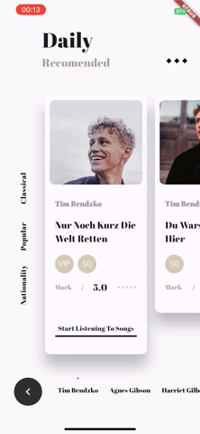

# Daily Music App

A new Flutter project. UI development based on profesional

- Credits for the design: [Insipration dribbble](https://dribbble.com/shots/7859350-Daily-music-recommendation-software)

## Getting Started

For download the packages:

```sh
flutter pub get
```

## Main Features

- **Personalized recommendations:** The app uses a powerful recommendation algorithm to provide users with music recommendations based on their listening history and preferences.

- **Catalogue Browsing:** Users can browse a vast catalog of songs and artists, search for music by genre or artist, and get detailed information about their favorite songs.

### Popular packages used

- bloc
- svg_flutter

Demo:



### Licence
This project is under the licence [MIT Licence](https://opensource.org/license/mit/)

@paolojoaquinp